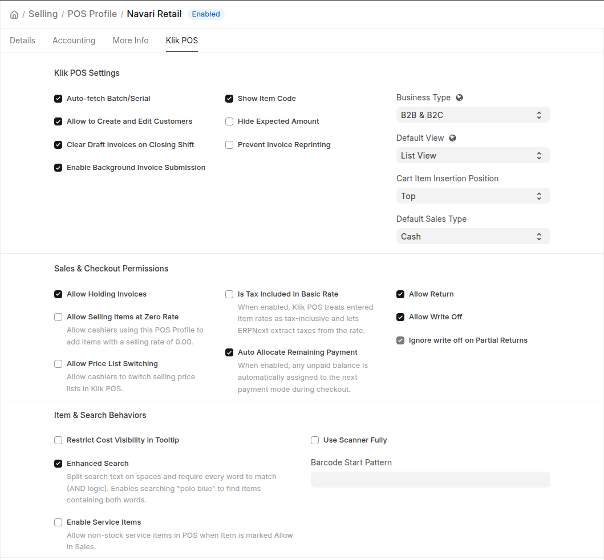
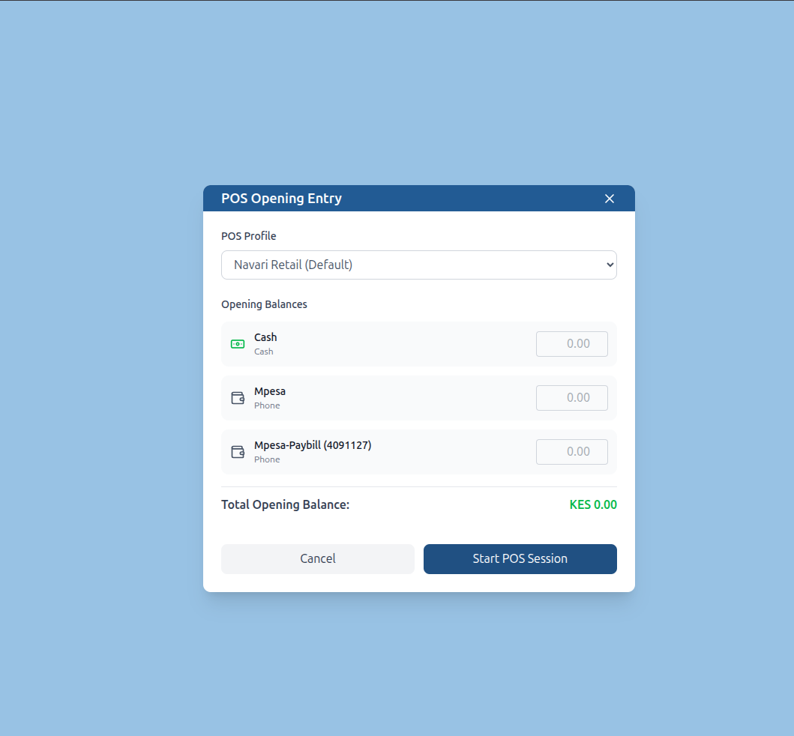
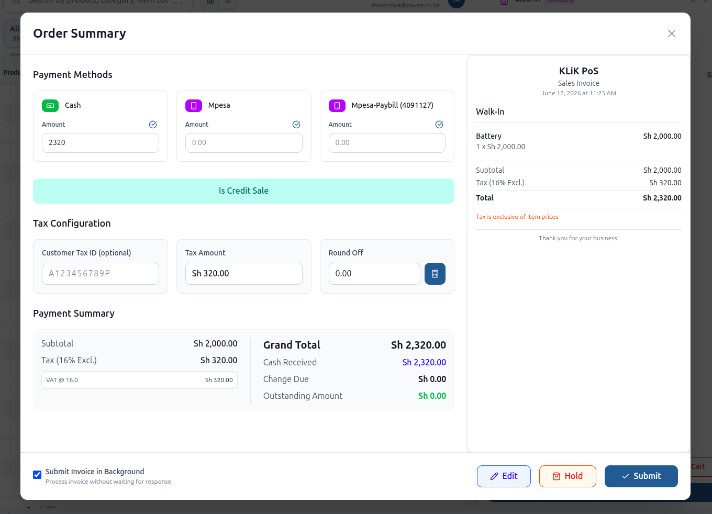
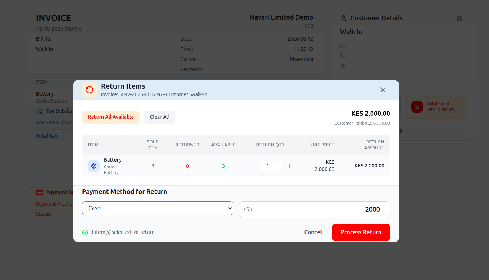

<div align="center" markdown="1">

<!--  -->
<h1>KLiK PoS</h1>

[](https://github.com/Beveren-Software-Inc/KLiK_PoS/actions/workflows/ci.yaml) <br>

**Modern Point of Sale for Retail Businesses**

</div>

<div align="center">
	
</div>
<br />
<div align="center">
	<a href="https://beverensoftware.com/">Website</a>
	-
	<a href="#documentation">Documentation</a>
</div>

---

## KLiK PoS

KLiK PoS is an open-source Point of Sale application for ERPNext and the Frappe Framework. It provides a responsive POS interface at `/klik_pos` while keeping ERPNext as the system of record for customers, items, stock, taxes, invoices, payments, and accounting.

It is simple, modern, responsive and feature-rich

---

### Motivation
The default ERPNext PoS often fall short. They lack strong UX design, miss key compliance requirements (such as ZATCA tax regulations), and have limited social media integration—resulting in a subpar overall experience. Many of ERPNext’s older POS solutions are outdated, don’t support newer versions (v15 and above), and no longer meet today’s business needs.

KLiK PoS was built to close this gap—offering a simple, modern, compliant, and feature-rich POS system designed specifically for ERPNext. Our goal is to deliver a seamless, enjoyable checkout experience—whether in-store or on the go—empowering sales teams to sell smarter, stay compliant, and serve customers with speed and confidence.

---

## Key Features

- **ZATCA Compliance**: Built-in ZATCA compliance by default for Saudi Arabian tax regulations
- **Flexible Sales Modes**: Supports B2C, B2B, or hybrid modes to suit different business needs
- **Smart Invoice Sharing**: Native Email, WhatsApp, and SMS integration for seamless invoice delivery
- **Barcode Scanner Mode**: Dedicated scanner-only mode for fast sales through barcode scanning
- **Multi-Invoice Credit Notes**: Create credit notes for single or multiple invoices effortlessly
- **Customer Management**: Create or edit individual or business customers directly from PoS
- **Payment Processing**: Support for multiple payment methods with seamless round-off (write-off) handling
- **Salesperson PINs:** Multiple salespeople can share one register or login while still attributing each sale to the correct Sales Person.
- **Returns:** Full, partial, and multi-invoice returns using ERPNext return Sales Invoices.
- **Stock-aware selling:** Warehouse stock, product bundles, item variants, batch/serial handling, and queued-invoice stock reservation.
- **Integrations and extensions:** Delivery charges, loyalty points, WhatsApp/SMS/email sharing, optional M-Pesa integration, and ZATCA field awareness when a compatible ZATCA app is installed.

---

## Key Sections

The detailed consultant and implementation documentation is in `docs/`:

- [Installation and Prerequisites](docs/installation.md)
- [Configuration](docs/configuration.md)
- [Opening and Closing](docs/opening-and-closing.md)
- [Selling](docs/selling.md)
- [Returns](docs/returns.md)
- [Payments and Reconciliation](docs/payments-and-reconciliation.md)
- [Additional Features](docs/additional-features.md)
- [Roles and Permissions](docs/roles-and-permissions.md)
- [Troubleshooting](docs/troubleshooting.md)

<details open>

<summary>More</summary>

<br />

<div align="center">
	
	<br /><br />
	
	<br /><br />
	
	<br /><br />
	
	<br /><br />
	
</div>

</details>

---

## Production Setup

### Self Hosting

Install the app using Bench:

```bash
cd $PATH_TO_YOUR_BENCH
bench get-app https://github.com/navariltd/klik_pos
bench --site <site-name> install-app klik_pos
bench --site <site-name> migrate
bench restart
```

Access the POS at:

```text
http(s)://your-site/klik_pos
```

After installation, configure the ERPNext POS Profile, payment methods, accounts, warehouse, customers, items, taxes, and users before using the POS. See [Installation and Prerequisites](docs/installation.md) and [Configuration](docs/configuration.md).

### Managed Hosting

KLiK PoS can be hosted on a managed Frappe environment such as Frappe Cloud, subject to app compatibility and dependency requirements.

---

## Development Setup

### Backend

1. [Install Frappe/ERPNext](https://frappeframework.com/docs/v15/user/en/installation)
2. Install this app on a site.
3. Run migrations and start Bench.

### Frontend

The SPA source is included in `klik_spa`.

```bash
cd apps/klik_pos
yarn install
yarn dev
```

For production assets:

```bash
yarn build
bench build --app klik_pos
```

---

## Contributing

1. Fork the repository
2. Create a feature branch (`git checkout -b feature/amazing-feature`)
3. Commit your changes (`git commit -m 'Add amazing feature'`)
4. Push to the branch (`git push origin feature/amazing-feature`)
5. Open a Pull Request

This app uses `pre-commit` for code formatting and linting.
Install and enable it:

```bash
cd apps/klik_pos
pre-commit install
```

---

## Support

For support and questions, please contact the development team at [info@beverensoftware.com](mailto:info@beverensoftware.com).

---

<div align="center">
	<a href="https://beverensoftware.com" target="_blank">
		
	</a>
</div>
