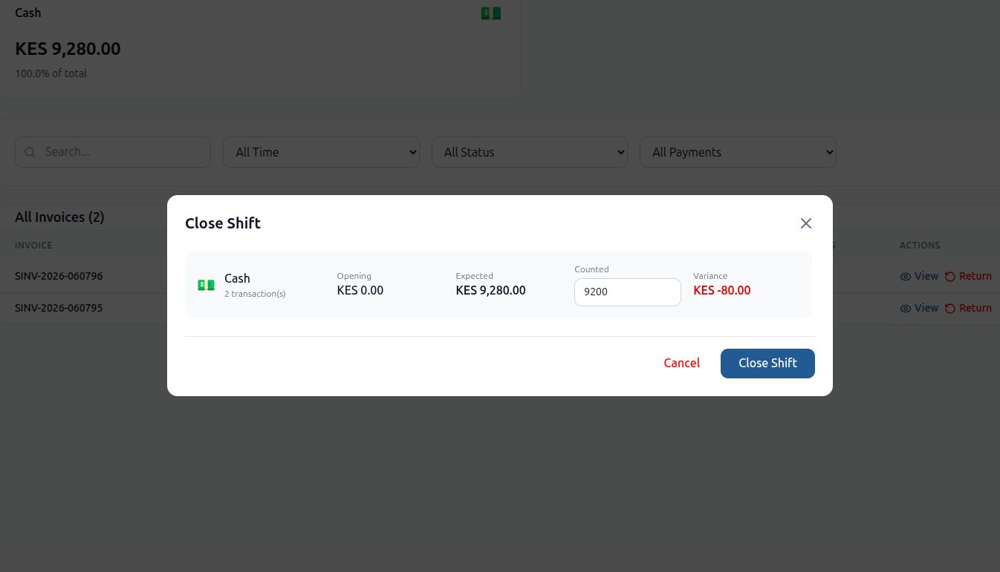

# Opening and Closing

Klik POS requires an open ERPNext POS Opening Entry before protected POS pages can be used. Settings and login are excluded from this guard.

## Opening a Session

Who can open a session depends on ERPNext permissions for POS Opening Entry and POS Profile. The frontend lists profiles assigned to the user by:

1. User Permission for POS Profile.
2. If no User Permission exists, the POS Profile Applicable Users table.

### Procedure

1. Open `/klik_pos`.
2. Log in.
3. If no open POS Opening Entry exists, the POS Opening Entry modal opens.
4. Select the POS Profile.
5. Review the payment methods loaded from the POS Profile.
6. Enter opening amounts for each mode of payment.
7. Select the create/open action.

Klik POS creates and submits a standard ERPNext POS Opening Entry with:

- Current user.
- User default Company.
- Selected POS Profile.
- Posting date and period start date.
- Opening balance rows.

The app prevents a user from opening another session when they already have an open POS Opening Entry.


## Reviewing the Current Session

Sales and customer payments are linked to the active session through `custom_pos_opening_entry`.

To review:

1. Open the Closing Shift page.
2. Review invoices filtered to the current POS Profile and current POS Opening Entry.
3. Review payment summaries by mode of payment.
4. Investigate Draft, Failed, or unpaid invoices before closing.

Admins, Sales Managers, and System Managers may see broader payment summaries by day in backend APIs. Cashier views are scoped to the current opening entry.

## Closing a Session

Closing creates and submits an ERPNext POS Closing Entry.

### Procedure

1. Open the Closing Shift page.
2. Review listed Sales Invoices for the current session.
3. Review payment-mode totals.
4. Enter counted closing amounts for each mode of payment.
5. Submit the closing entry.

Klik POS calculates reconciliation rows:

```text
Expected Amount = Opening Amount + Submitted Sales Invoice Payment Amounts
Difference = Closing Amount - Expected Amount
```

The closing document includes:

- User, company, POS Profile.
- Period start and period end.
- Linked POS Opening Entry.
- Total quantity, net total, total amount, and grand total from submitted Sales Invoices linked to the opening entry.
- Payment reconciliation rows.
- Tax rows sent from the frontend, where available.
- Custom Sales Invoice child rows for submitted invoices linked to the opening entry.

After submission, Klik POS links the POS Closing Entry back to the POS Opening Entry.



## Resolving a Payment Variance

1. Identify the affected mode of payment.
2. Compare opening amount, expected amount, and counted closing amount.
3. Inspect submitted Sales Invoices linked to the POS Opening Entry.
4. Inspect Klik-created Payment Entries linked to the POS Opening Entry.
5. Confirm returns were recorded with the correct refund method.
6. Record the correct counted closing amount.
7. Use standard finance approval for any variance posting or investigation.

> **Warning:** Do not edit General Ledger entries or submitted invoice payment rows directly to force a closing total to match. Correct the source document through supported ERPNext accounting workflows.

## Handling a Session That Cannot Close

Common causes:

- No open POS Opening Entry exists for the user.
- User lacks permission to create or submit POS Closing Entry.
- Required accounting defaults are missing.
- Submitted invoices have inconsistent payment rows.
- Background invoices are still queued or failed.
- Draft invoices remain and business policy requires them to be submitted or deleted before closing.

Recommended steps:

1. Confirm the POS Opening Entry status is `Open`.
2. Check Draft Sales Invoices linked to the opening entry.
3. Check Sales Invoices with `queue_status` of `Queued`, `Processing`, or `Failed`.
4. Retry failed queued invoices where appropriate.
5. Verify payment methods and accounts.
6. Ask an Accounts User or System Manager to review permissions and accounting errors.

## Draft Invoices on Closing

If `Clear Draft Invoices on Closing Shift` is enabled on the POS Profile, Klik POS deletes draft Sales Invoices linked to the opening entry after the POS Closing Entry is submitted. It also cancels related stock reservations.

If the setting is disabled, Draft invoices remain in ERPNext and can be reviewed later.

---

Previous: [Configuration](configuration.md) | Next: [Selling](selling.md)
